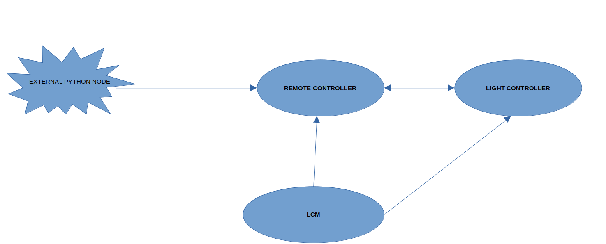

# 
 Schoelly Light Source

This document explains in detail about the Light Source. 

## Introduction

According to the current plan, light source module will have the following components:
1. Remote controller 
2. Light controller
3. LCM

### States of a node
Each of the above mentioned components can ba considered as a node
The four main States of any Node in this system are:
 1. PRIMARY_STATE_UNCONFIGURED
 2. PRIMARY_STATE_ACTIVE
 3. PRIMARY_STATE_INACTIVE
 4. PRIMARY_STATE_SHUTDOWN

The states of Light Controller and Remote controller will be triggered by LCM

### System states of LCM

LCM master has 5 system states in "PRIMARY_STATE_ACTIVE" State:
 1.SYSTEM_STATE_ACTIVE_INITIALIZATION
 2.SYSTEM_STATE_ACTIVE_PRE_SURGERY
 3.SYSTEM_STATE_ACTIVE_SURGERY
 4.SYSTEM_STATE_ACTIVE_POST_SURGERY
 5.SYSTEM_STATE_ACTIVE_UPDATE
 When the system state of the system in "SYSTEM_STATE_ACTIVE_SURGERY",Light controller will be active

 
